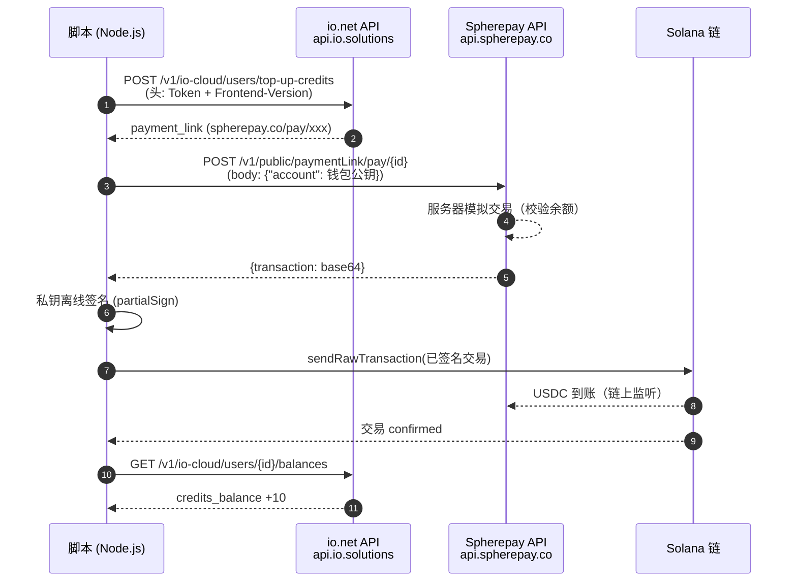
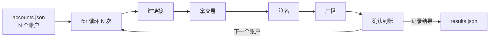

# io-net-batch-topup

纯 HTTP + Solana 链上签名的 io.net「IO Credits」批量充值脚本。无需浏览器、无需钱包插件、无需人工点击，100 个账户 = 一个循环。

> ⚠️ **重要声明**：使用前请务必先阅读 [`docs/RISKS_AND_ASSUMPTIONS.md`](docs/RISKS_AND_ASSUMPTIONS.md) 与 [`docs/REVERSE_ENGINEERING.md`](docs/REVERSE_ENGINEERING.md)。

---

## 它能做什么

给 N 个 io.net 账户批量充值 IO Credits（每账户最低 $10，`1 IO Credit = 1 USD`），每个账户由一个独立钱包用 USDC（Solana 链）支付。

## 前置条件

- **N 个 io.net 账户的 JWT**：登录后从浏览器 cookie `authPersistedState_1_0` 中提取（形如 `{"status":"authenticated","token":"eyJhbGci..."}`，取 `token` 字段）。
- **N 个钱包私钥**（base58）：每个钱包 **≥ 10 USDC + 少量 SOL**（付 gas）。
- 钱包 ↔ 账户一一对应。
- Node.js 18+，可访问 Solana RPC。

## 工作原理（4 步）

```text
① 建链接    POST api.io.solutions/v1/io-cloud/users/top-up-credits
             （头：Token=<JWT>, Frontend-Version=1.140.0）
             → 返回 payment_link
② 拿交易    POST api.spherepay.co/v1/public/paymentLink/pay/{id}
             （body：{"account":"<钱包公钥>"}）
             → 返回 {transaction: base64}
③ 签名      @solana/web3.js：VersionedTransaction.deserialize → partialSign
④ 广播       sendRawTransaction → confirmTransaction
```

### 数据流图



### 规模化循环



## 项目结构

```
io-net-batch-topup/
├── README.md                          # 本文件
├── package.json                       # 依赖声明
├── .gitignore                         # 忽略敏感文件
├── .env.example                       # 环境变量示例
├── accounts.example.json              # 账户配置示例
├── src/
│   └── index.js                       # 主脚本（单文件，含全部逻辑）
└── docs/
    ├── RISKS_AND_ASSUMPTIONS.md       # ⚠️ 风险与猜测（务必先读）
    └── REVERSE_ENGINEERING.md         # 逆向过程与接口详情
```

## 快速开始

```bash
# 1. 安装依赖
npm install

# 2. 准备配置：复制示例，填入真实 JWT 与私钥
cp accounts.example.json accounts.json
# 编辑 accounts.json，格式：
# [{"email":"a@x.com","token":"<JWT>","secretKey":"<base58私钥>"}]

# 3. 运行
node src/index.js accounts.json
```

运行结果写入 `results.json`（每笔成功/失败明细）。

- 使用前请自行确认所在地区的法律法规（加密支付、KYC/AML、资金出境等），以及 io.net / Spherepay 的服务条款。
- 因使用本脚本导致的任何损失（封号、资金损失、合规风险等），作者不承担责任。
